# Kubernetes Security Controls — Validation Evidence

This document records the implementation and validation of the following controls:

- Kubernetes role-based access control (RBAC)
- OPA Gatekeeper admission policies
- A custom Gatekeeper `ConstraintTemplate`
- External Secrets Operator (ESO) with AWS Secrets Manager
- Trivy vulnerability scanning
- Cosign image signing and Sigstore policy-controller admission

All admission tests use Kubernetes server-side dry-run. This invokes the configured admission webhooks without creating a persistent workload.

## 1. Result summary

| Control | Validation result |
| --- | --- |
| RBAC role separation | Passed |
| Disallowed `latest` tag | Detected in warning mode |
| Missing CPU and memory limits | Detected in warning mode |
| Root user (`runAsUser: 0`) | Detected in warning mode |
| Host networking | Denied |
| Deployment naming convention | Denied when the prefix is invalid |
| Secret synchronization and rotation | Passed without restarting the application pods |
| HIGH or CRITICAL vulnerability gate | Failed the CI job before signing, as expected |
| Unsigned image admission | Denied |
| Trusted signed image admission | Passed |

## 2. Kubernetes RBAC

### 2.1 Access model

Three users are assigned separate responsibilities through GitOps-managed Kubernetes roles and bindings:

| User | Role | Effective scope |
| --- | --- | --- |
| `alice` | Developer | Manage application workloads in the `demo` namespace |
| `bob` | SRE | Read and operate pods across the cluster |
| `carol` | Viewer | Read-only cluster access |

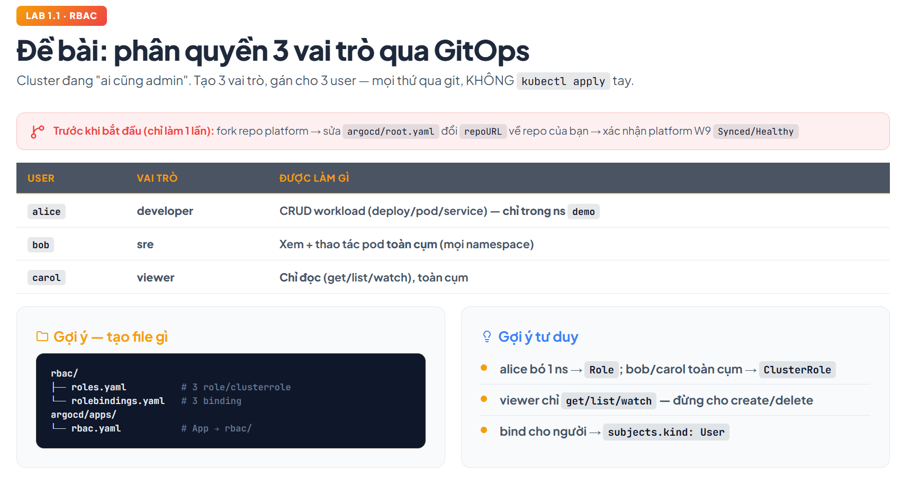

The expected authorization matrix is shown below.


### 2.2 Authorization test

Authorization was validated with user impersonation through `kubectl auth can-i`:

```bash
kubectl auth can-i create deployments.apps -n demo --as=alice
kubectl auth can-i create deployments.apps -n kube-system --as=alice
kubectl auth can-i get pods -A --as=bob
kubectl auth can-i delete nodes --as=carol
```

Observed results:

- Alice can create deployments in `demo`.
- Alice cannot create deployments in `kube-system`.
- Bob can read pods across all namespaces.
- Carol cannot delete cluster nodes.

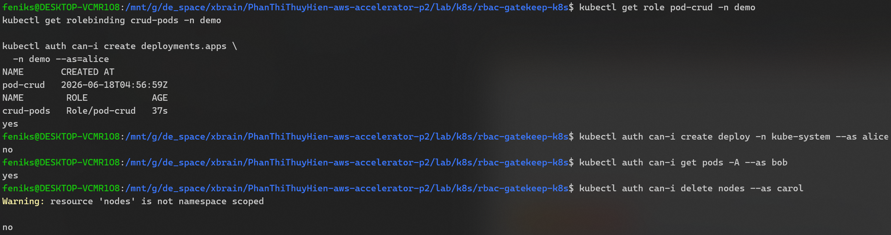

## 3. OPA Gatekeeper admission controls

### 3.1 Policy scope

The Gatekeeper configuration evaluates these workload properties:

- Disallowed image tag: `latest`
- Required CPU and memory limits
- Non-root execution
- Disabled host networking


### 3.2 Application manifest review

The application rollout was reviewed before admission testing:

- `hostNetwork` is not configured and therefore defaults to `false`.
- The container image uses a pinned version rather than `latest`.
- CPU and memory limits are configured.
- A container security context was added to require non-root execution.

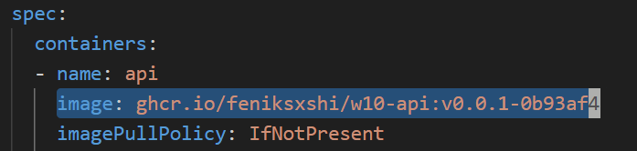


The relevant Gatekeeper constraints were also adjusted to target the required workload resources.

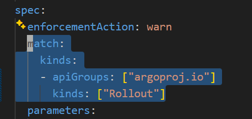

### 3.3 Admission test: disallowed `latest` tag

```bash
kubectl set image -f tmp/test-pod.yaml \
  test=busybox:latest --local -o yaml |
kubectl apply --dry-run=server -f -
```

Result: Gatekeeper detected the `latest` tag and emitted a warning. The resource remained admissible because this constraint uses `enforcementAction: warn`.

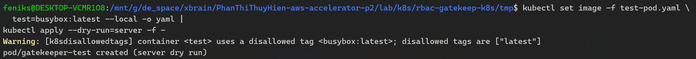

### 3.4 Admission test: missing resource limits

```bash
kubectl patch --local -f tmp/test-pod.yaml \
  --type=json \
  -p='[{"op":"remove","path":"/spec/containers/0/resources/limits"}]' \
  -o yaml |
kubectl apply --dry-run=server -f -
```

Result: Gatekeeper detected the missing CPU and memory limits and emitted a warning. The resource remained admissible because this constraint uses `enforcementAction: warn`.


### 3.5 Admission test: root execution

```bash
kubectl patch --local -f tmp/test-pod.yaml \
  --type=json \
  -p='[
    {
      "op": "replace",
      "path": "/spec/containers/0/securityContext/runAsUser",
      "value": 0
    }
  ]' \
  -o yaml |
kubectl apply --dry-run=server -f -
```

Result: Gatekeeper detected `runAsUser: 0` and emitted a warning. The resource remained admissible because this constraint uses `enforcementAction: warn`.

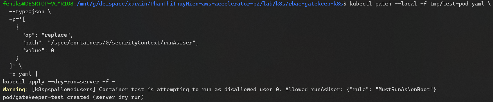

### 3.6 Admission test: host networking

```bash
kubectl patch --local -f tmp/test-pod.yaml \
  --type=json \
  -p='[
    {
      "op": "add",
      "path": "/spec/hostNetwork",
      "value": true
    }
  ]' \
  -o yaml |
kubectl apply --dry-run=server -f -
```

Result: Gatekeeper denied the request because `hostNetwork: true` violates the enforced policy.

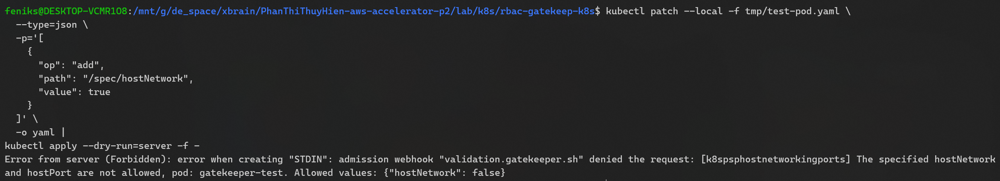

### 3.7 Admission test: compliant pod

```bash
kubectl apply --dry-run=server -f tmp/test-pod.yaml
```

The compliant pod uses a pinned image, defines resource limits, runs as a non-root user, and does not enable host networking. It was admitted without a Gatekeeper violation.

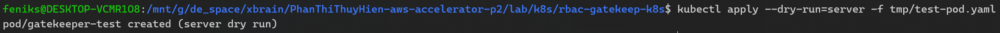

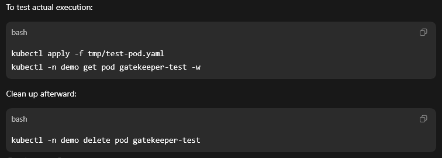

## 4. Custom deployment naming policy

The custom policy is implemented in:

- `gatekeeper/templates/template-naming-convention.yaml`
- `gatekeeper/constraints/enforce-naming-convention.yaml`

It requires deployments in the `demo` namespace to start with either `api-` or `web-`.

The following test uses the invalid name `gatekeeper-test`:

```bash
kubectl -n demo create deployment gatekeeper-test \
  --image=busybox:1.36.1 --dry-run=server -o yaml
```

Result: the deployment was denied because its name did not have an allowed prefix.

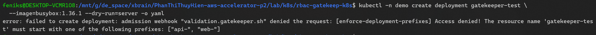

## 5. External Secrets Operator and AWS Secrets Manager

### 5.1 AWS credentials and secret synchronization

AWS credentials were provided to the local Minikube environment for ESO testing. ESO then synchronized the configured AWS Secrets Manager value into Kubernetes.

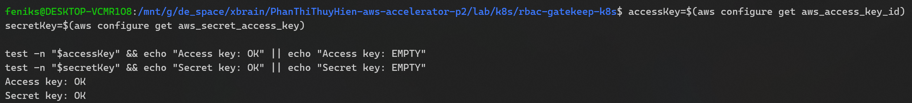

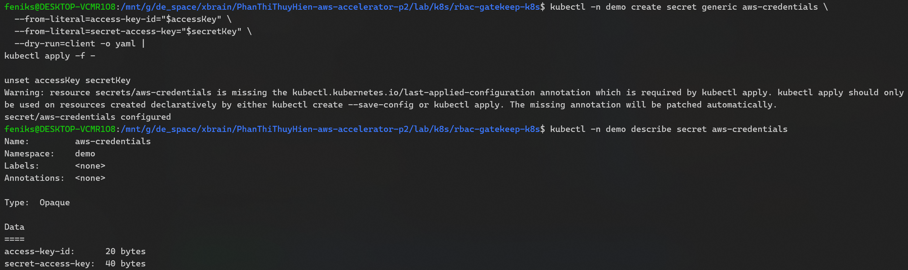

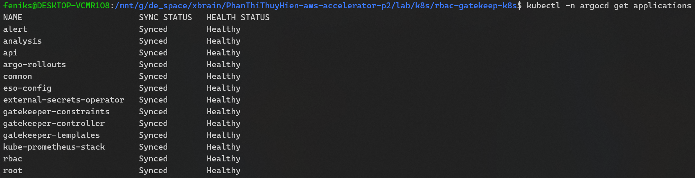

### 5.2 Secret rotation

The source secret value was changed in AWS Secrets Manager.

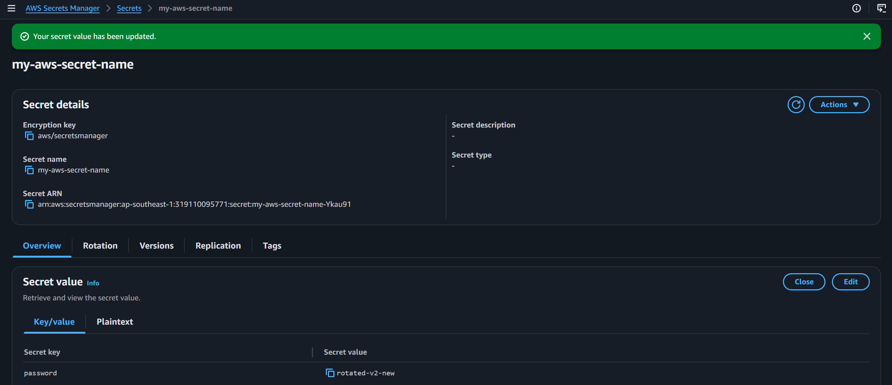

ESO subsequently synchronized the new value into Kubernetes.

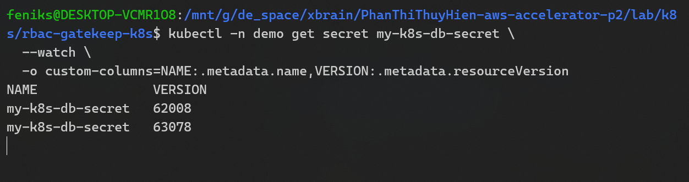

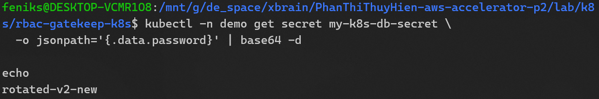

### 5.3 Rotation without a pod restart

Pod state was captured before and after the secret rotation.

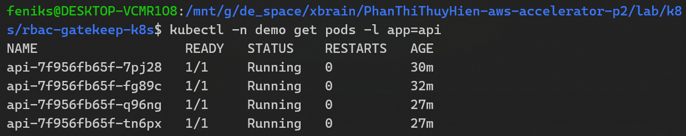

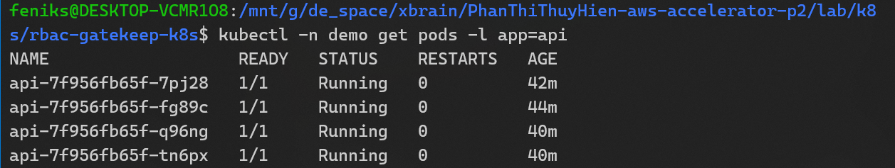

The evidence confirms that:

- Pod names did not change.
- The restart count remained zero.
- The pods remained in the `Running` state.

The mounted secret file was then checked from the workload.

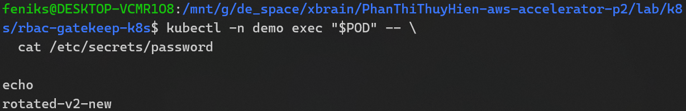

Additional synchronization tests confirmed that the rotated value reached the mounted file.

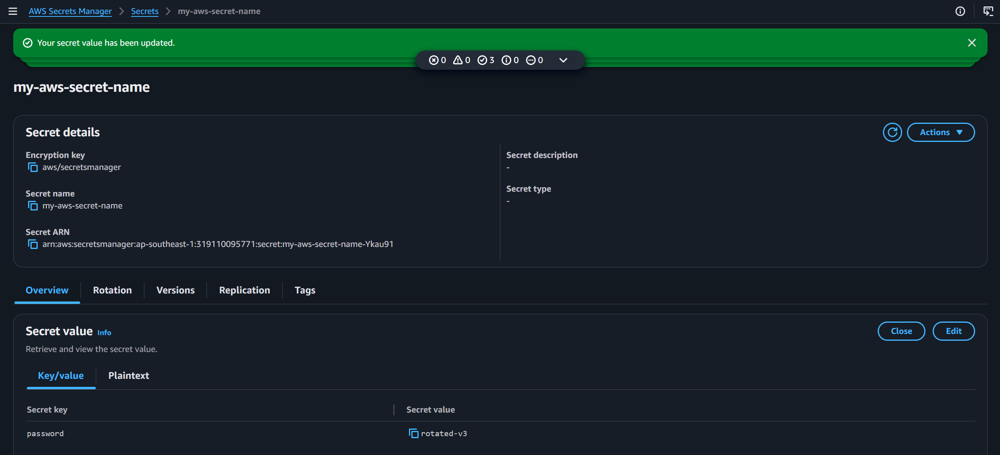

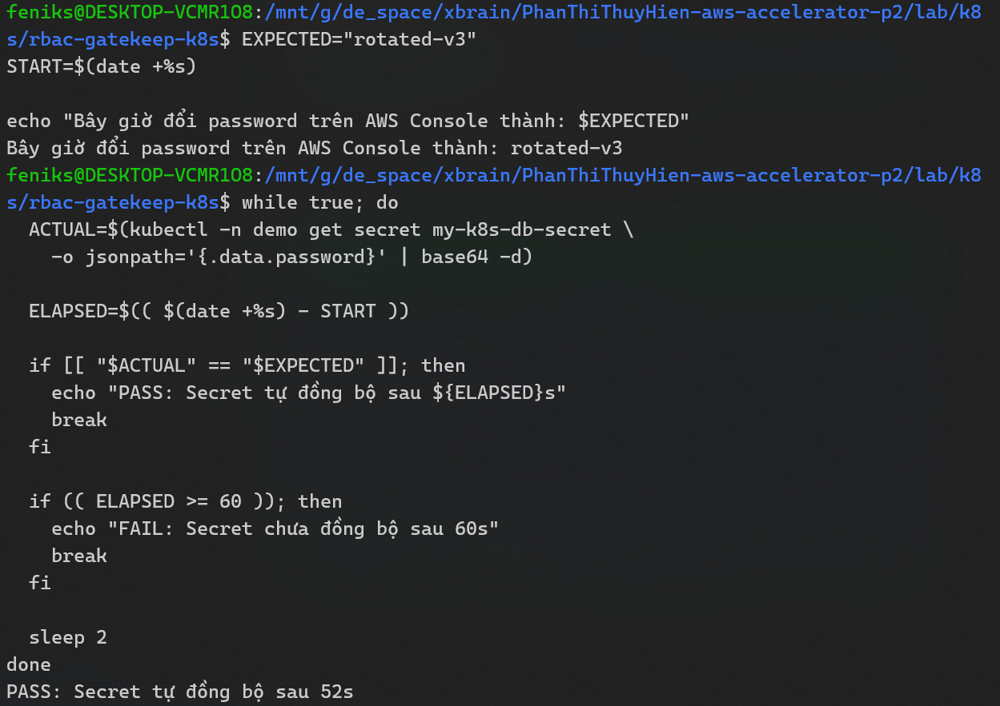

### 5.4 Repository secret-safety check

The repository was checked to ensure that credentials and private secret material were not committed.

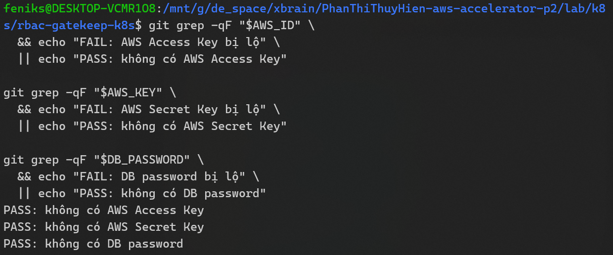

## 6. Trivy and Cosign software-supply-chain controls

### 6.1 CI control flow

The CI workflow performs the following sequence:

```text
Build and push image -> Trivy scan -> Sign image digest with Cosign
```

Signing occurs only after the vulnerability scan succeeds.

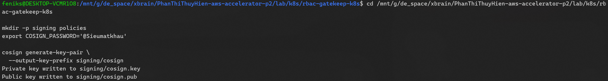

Key management follows these rules:

- The private key is not committed to the repository.
- The CI private key and password are stored as GitHub Actions secrets.
- `signing/cosign.pub` is committed because it is the trusted public verification key.

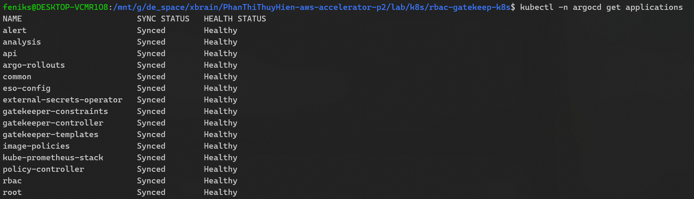

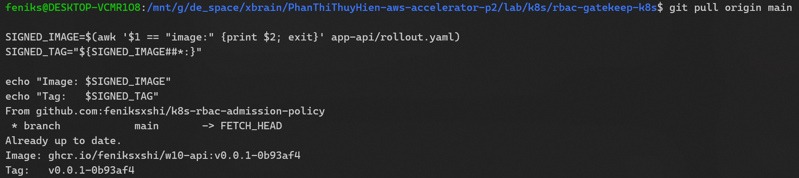

### 6.2 HIGH or CRITICAL vulnerability failure

A test image containing a HIGH or CRITICAL vulnerability caused the GitHub Actions job to fail.

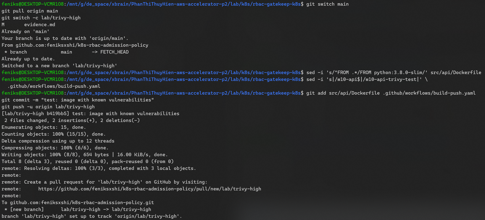

The workflow stopped before the Cosign signing step, so a vulnerable image was not promoted as trusted.

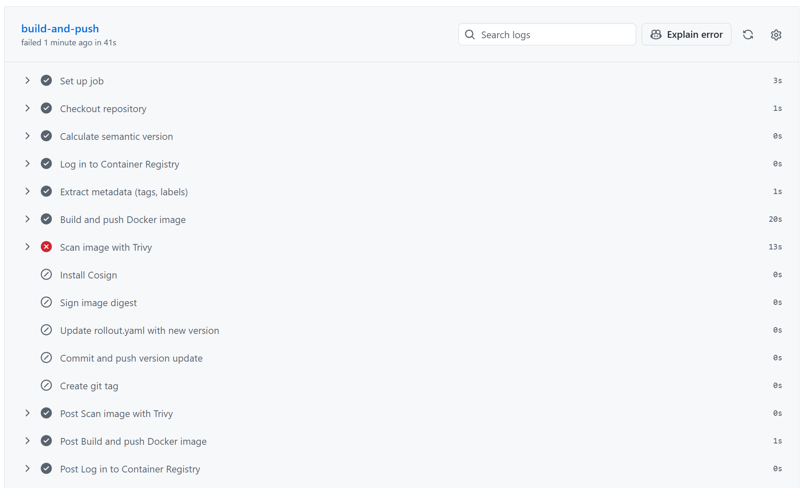

### 6.3 Unsigned image rejection

A new image digest was created without adding a trusted signature.

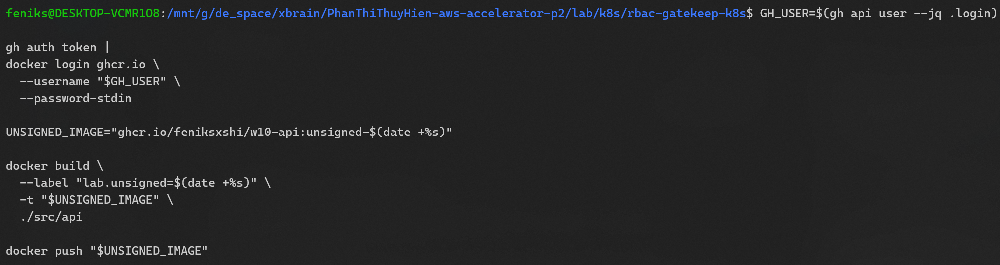

Cosign verification confirmed that no trusted signature existed for that digest.

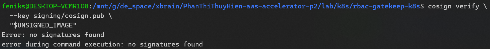

The Sigstore admission webhook then denied the image during Kubernetes server-side dry-run.

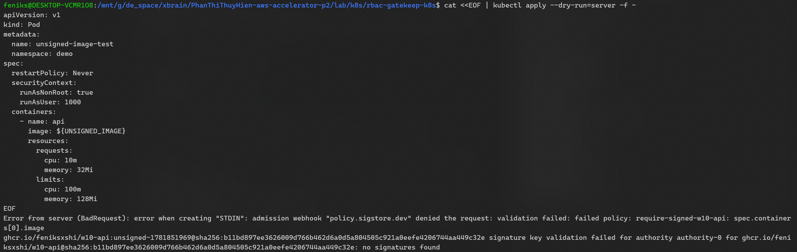

### 6.4 Trusted signed image admission

A successful CI run produced and signed an image digest. Local Cosign verification confirmed that the claims and signature were valid against `signing/cosign.pub`.

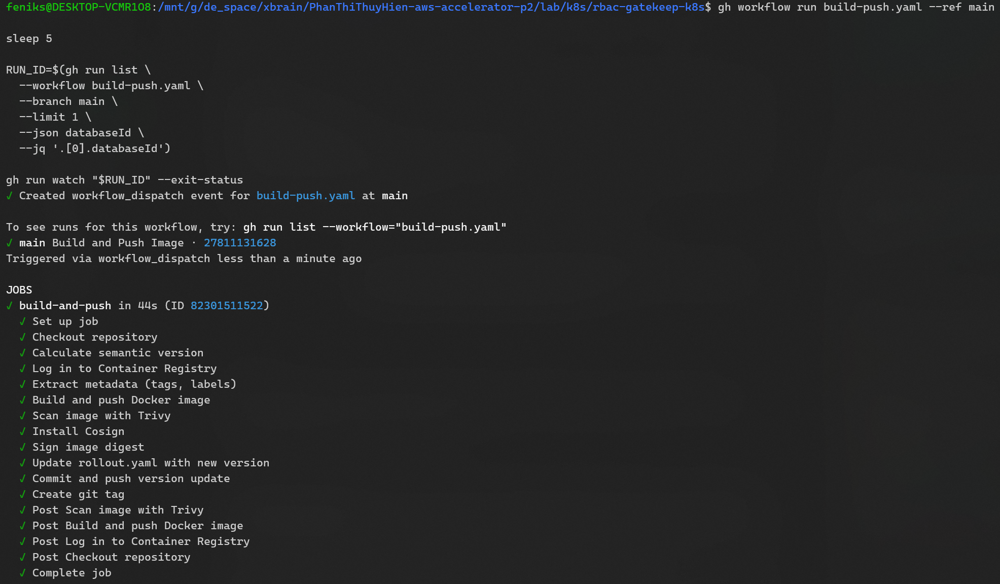

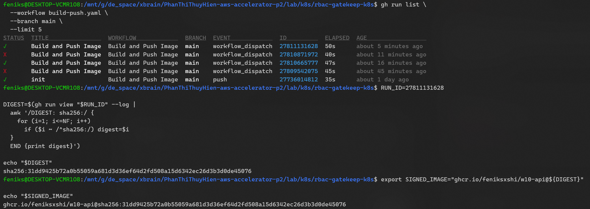

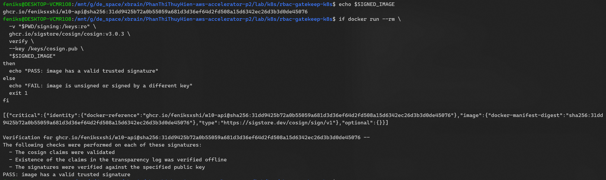

For compatibility with the deployed policy-controller, the signature was also published using Cosign's legacy signature-tag layout.

```bash
docker manifest inspect \
  "${IMAGE}:sha256-${DIGEST#sha256:}.sig" >/dev/null &&
echo "PASS: legacy signature exists"
```

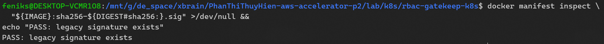

The signed digest was then submitted to Kubernetes admission:

```bash
SIGNED_IMAGE="${IMAGE}@${DIGEST}"

kubectl set image -f tmp/test-pod.yaml \
  test="$SIGNED_IMAGE" --local -o yaml |
kubectl apply --dry-run=server -f -
```

Result: the policy-controller verified the trusted signature and admitted the pod.

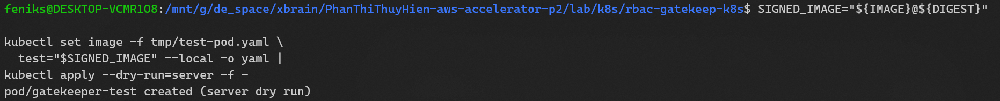

## 7. Conclusion

The validation demonstrates layered Kubernetes security controls across authorization, admission, secret management, vulnerability scanning, and image provenance. RBAC enforces separation of duties; Gatekeeper detects or denies policy violations according to each constraint's configured enforcement action; ESO rotates external secrets without restarting application pods; Trivy prevents vulnerable images from reaching the signing stage; and policy-controller admits only images signed by the configured trusted Cosign key.
