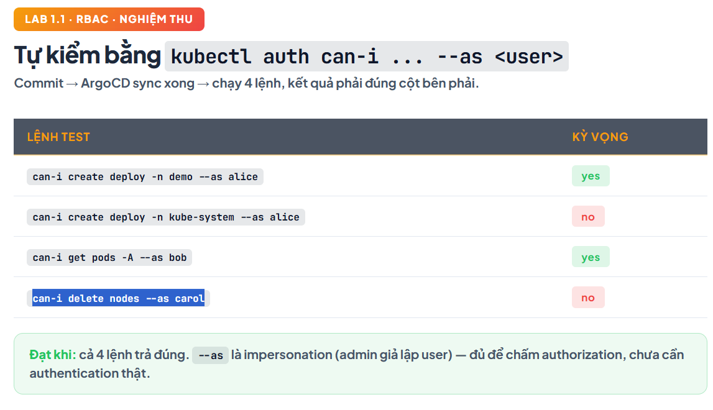
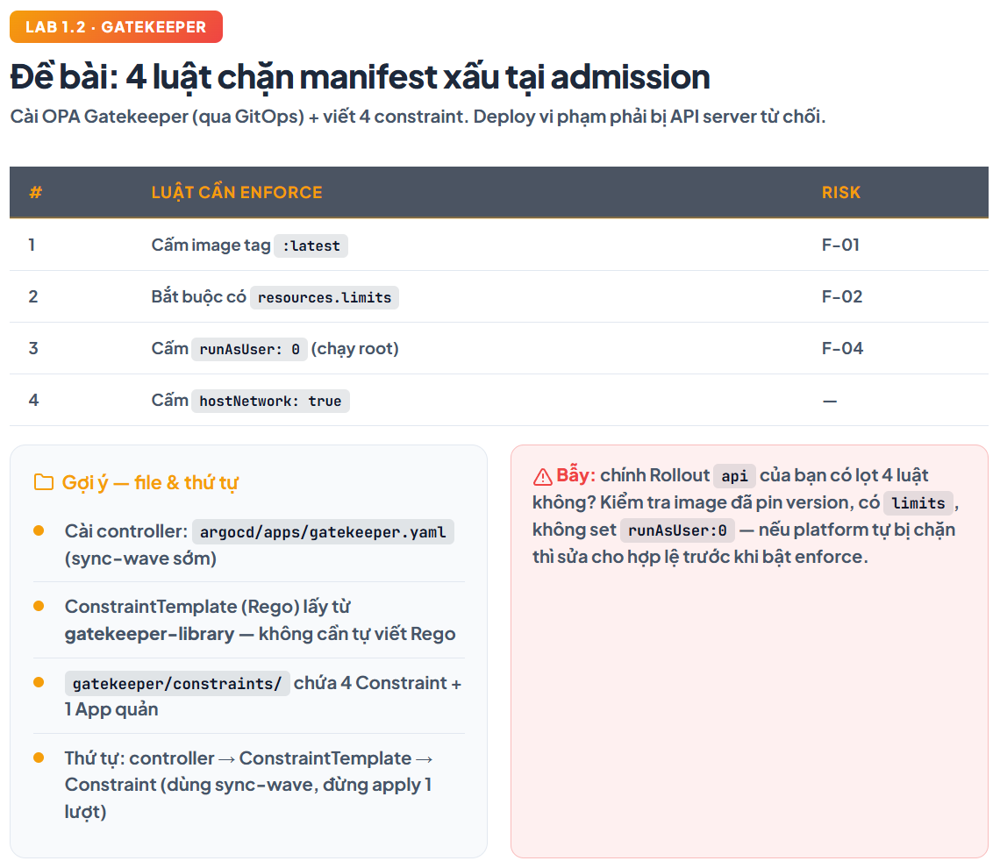
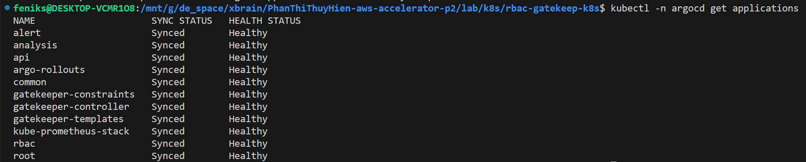
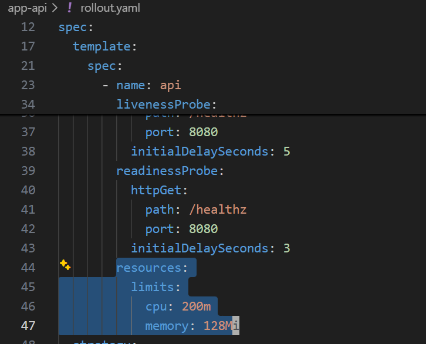
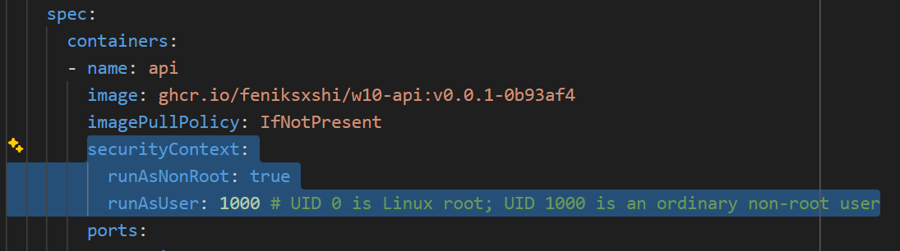
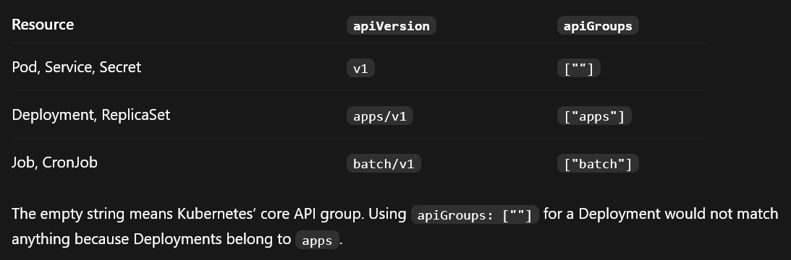

Test: 


---



Reviewing the current `rollout.yaml`
- No `hostNetwork` -> Not configured, defaults to `false`
- No `latest` image -> Uses `v0.0.1-0b93af4`
	
- CPU/memory limits -> Both are configured 
	
- Must run non-root  -> No securityContext; image defaults to root ❌ \
	Fix: 
	
	Also modify this part in 4 constraints files:
	

Test: \
Use Kubernetes server-side dry-run. It triggers Gatekeeper admission without creating a real Pod. 
1. Reject `:latest`
```bash
kubectl run test-latest -n demo --image=busybox:latest \
  --restart=Never --dry-run=server \
  --overrides='{"apiVersion":"v1","spec":{"containers":[{"name":"test-latest","image":"busybox:latest","command":["sh","-c","sleep 60"],"securityContext":{"runAsNonRoot":true,"runAsUser":1000},"resources":{"limits":{"cpu":"100m","memory":"32Mi"}}}]}}'
```
--- 
Latest commit on origin/main
```bash
git fetch origin main
git rev-parse --short origin/main
```

Commit currently compared by Argo CD
```bash
kubectl -n argocd get application root \
  -o jsonpath='{.status.sync.revision}{"\n"}'
```

Force a refresh:
```bash
kubectl -n argocd annotate application root \
  argocd.argoproj.io/refresh=hard --overwrite

kubectl -n argocd get application root -w
```
