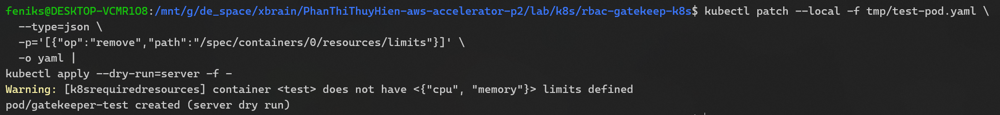

# RBAC + Policy Enforcement for K8s Cluster
## RBAC


Test: 


## Policy Enforcement


Reviewing the current `rollout.yaml`
- No `hostNetwork` -> Not configured, defaults to `false`
- No `latest` image -> Uses `v0.0.1-0b93af4`
	
- CPU/memory limits -> Both are configured 
	
- Must run non-root  -> No securityContext; image defaults to root ❌ \
	Fix: 
	
	Also modify this part in 4 constraints files:
	

Test: \
Use Kubernetes server-side dry-run. It triggers Gatekeeper admission without creating a real Pod. 
1. Reject `:latest`
	```bash
	kubectl set image -f /tmp/test-pod.yaml \
	  test=busybox:latest --local -o yaml |
	kubectl apply --dry-run=server -f -
	```
	

2. Reject missing resource limits
	```bash
	kubectl patch --local -f tmp/test-pod.yaml \
	  --type=json \
	  -p='[{"op":"remove","path":"/spec/containers/0/resources/limits"}]' \
	  -o yaml |
	kubectl apply --dry-run=server -f -
	```
	

3. Reject runAsUser: 0
	```bash
	kubectl patch --local -f tmp/test-pod.yaml \
	  --type=json \
	  -p='[
	    {
	      "op": "replace",
	      "path": "/spec/containers/0/securityContext/runAsUser",
	      "value": 0
	    }
	  ]' \
	  -o yaml |
	kubectl apply --dry-run=server -f -
	```
	

3. Reject host network
	```bash
	kubectl patch --local -f tmp/test-pod.yaml \
	  --type=json \
	  -p='[
	    {
	      "op": "add",
	      "path": "/spec/hostNetwork",
	      "value": true
	    }
	  ]' \
	  -o yaml |
	kubectl apply --dry-run=server -f -
	```
	

4. Valid Pod (version pinned + resource limits + non-root user)
	```bash
	kubectl apply --dry-run=server -f tmp/test-pod.yaml
	```
	
	Produce no Gatekeeper violations.
	

## Custom ConstraintTemplate
Docs: https://open-policy-agent.github.io/gatekeeper/website/docs/howto/


--- 
Latest commit on origin/main
```bash
git fetch origin main
git rev-parse --short origin/main
```

Commit currently compared by Argo CD
```bash
kubectl -n argocd get application root \
  -o jsonpath='{.status.sync.revision}{"\n"}'
```

Force a refresh:
```bash
kubectl -n argocd annotate application root \
  argocd.argoproj.io/refresh=hard --overwrite

kubectl -n argocd get application root -w
```
